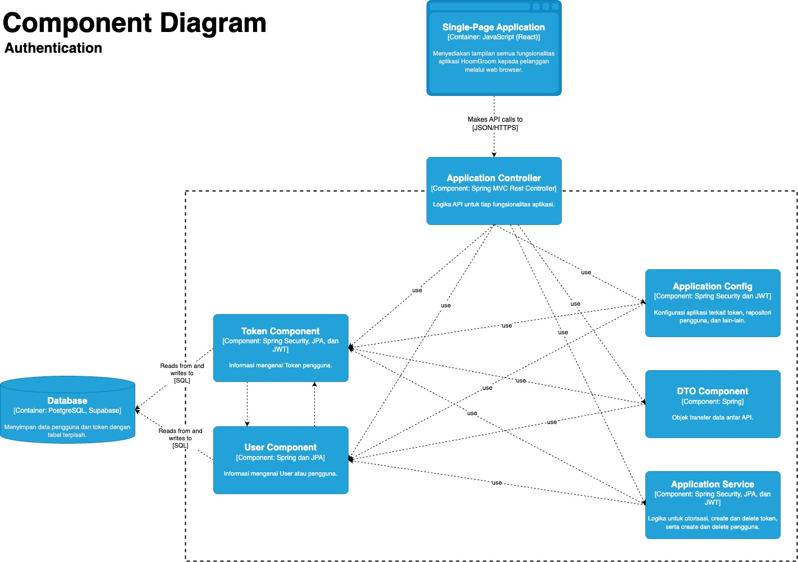
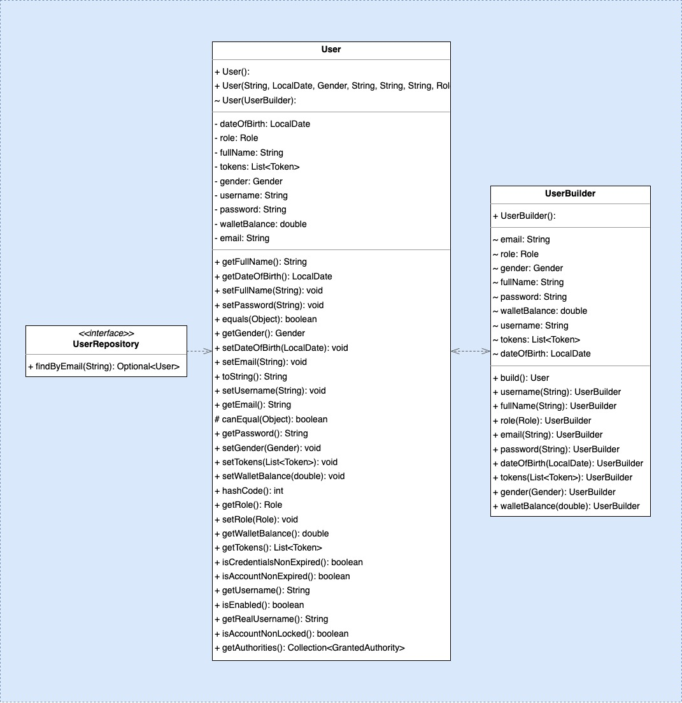
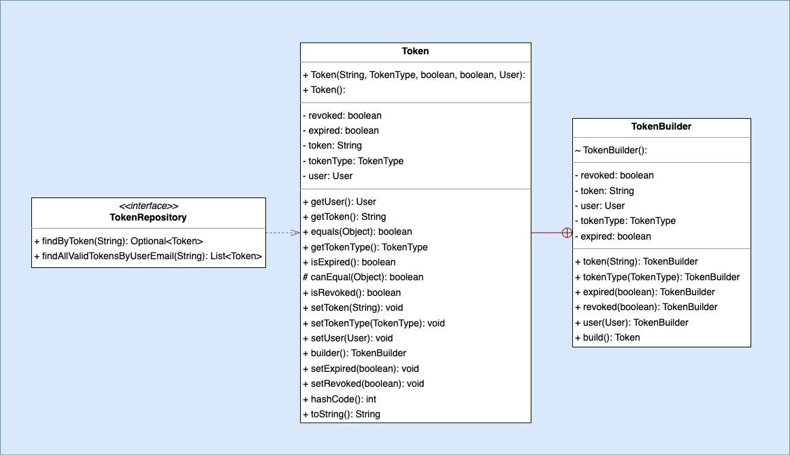
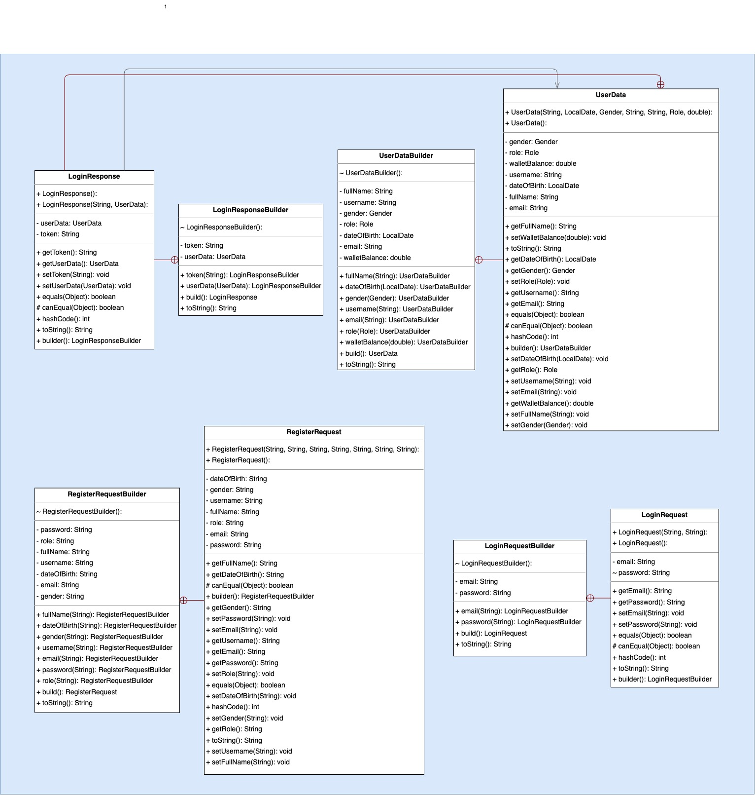
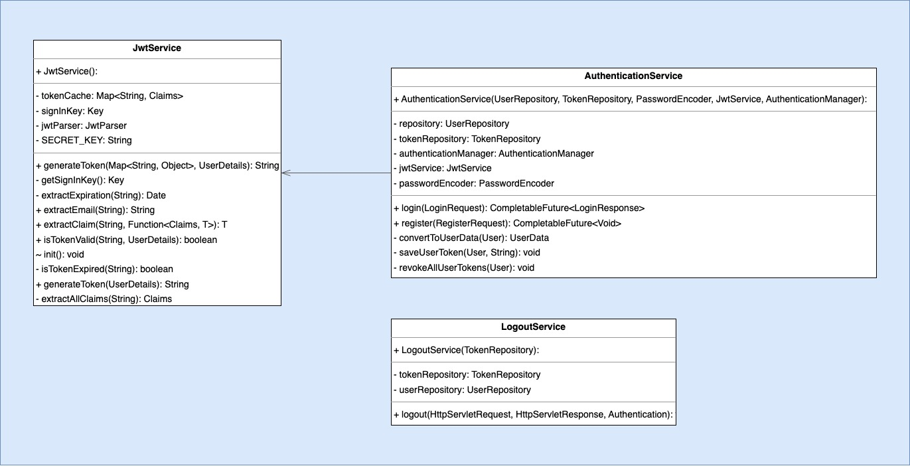
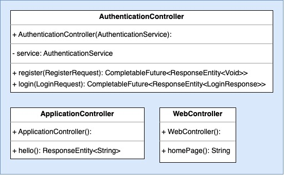
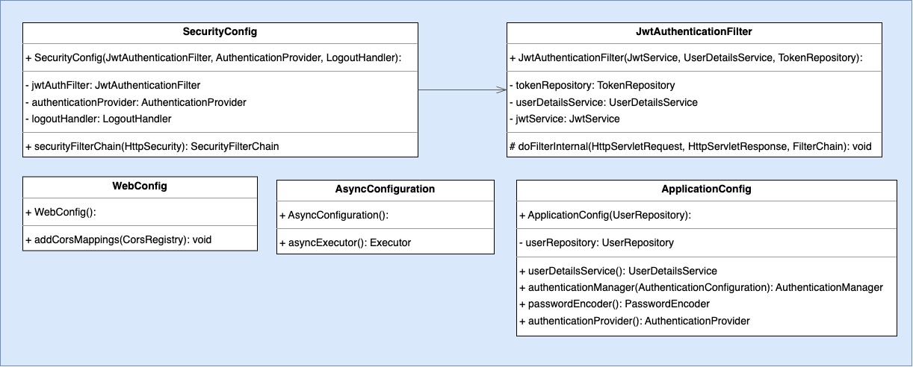
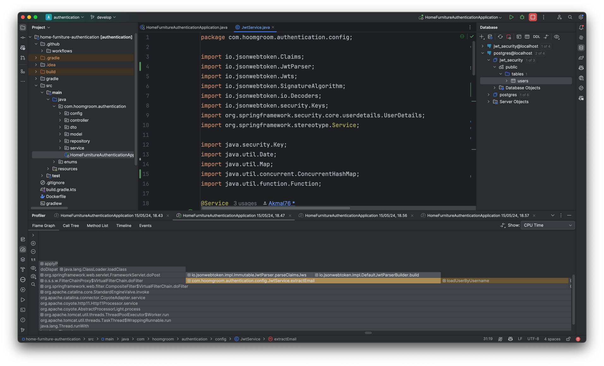
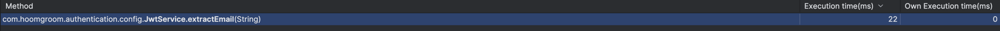

# HoomGroom - Authentication
This is the [authentication](http://34.143.229.201/) service for HoomGroom. It is responsible for managing user accounts, authentication, and authorization.

**Akmal Ramadhan - 2206081534 - A06**

# Module 12: Software Architecture
## Component Diagram

## Code Diagram
### User Component

### Token Component

### Data Transfer Object Component

### Service Component

### Controller Component

### Configuration Component

# Module 11: Deployment and Monitoring
## Profiling
Saya menggunakan IntelliJ Profiler untuk mencari salah satu _bottleneck_ dari _service_ ini.

Salah satu method yang saya temukan yaitu `extractEmail` pada `JwtService` saya. Method ini digunakan ketika kita memerlukan token JWT untuk user yang sudah login agar dapat mengakses halaman yang hanya bisa diakses oleh user yang sudah login. Method ini memerlukan waktu yang **22 ms** sebelum optimisasi dilakukan.

**Optimasi yang saya lakukan:**
Membuat _instance_ `JwtParser` sekali saja dalam _constructor_ untuk mengurangi _overhead_ setiap token di-_parsing_. Simpan token yang telah di-_parsing_ ke dalam _cache_ `tokenCache`.

Saya melakukan _profiling_ lagi dan mendapatkan hasil sebagai berikut:

Diperoleh waktu yang sedikit lebih cepat yaitu **10 ms**.